# 🛡️ Fake Job Listing Detection System

A Machine Learning-powered web application that detects whether a job posting is **Real** or **Fraudulent** using Natural Language Processing (NLP) and Support Vector Machine (SVM) classification.

Developed as a **Mini Project for B.Tech Computer Science Engineering (Data Science)**.

---

## 📖 Table of Contents

- Overview
- Problem Statement
- Features
- Technology Stack
- System Architecture
- Machine Learning Pipeline
- Model Performance
- Application Screenshots
- System Design Diagrams
- Installation
- Running the Project
- Project Structure
- Future Enhancements
- Team Members

---

# 🎯 Overview

Online job platforms have simplified recruitment, but they have also become a target for scammers who post fraudulent job listings.

Many fake job postings appear convincing and often include:

- Unrealistic salaries
- Remote work opportunities
- Immediate hiring
- No experience requirements
- Verification fees or upfront payments

This project uses Machine Learning and NLP techniques to analyze job descriptions and determine whether they are likely to be **Real** or **Fake**.

---

# ❗ Problem Statement

Fake job postings pose a significant risk to job seekers by causing:

- Financial fraud
- Identity theft
- Personal data leakage
- Employment scams

Manual verification of every job posting is difficult and time-consuming.

The objective of this project is to build an intelligent system that can automatically detect suspicious job postings and provide users with a fraud probability score.

---

# ✨ Features

## Core Features

- Real vs Fake Job Classification
- Fraud Probability Prediction
- Confidence Score Display
- Real-Time Analysis
- Response Time Measurement

## User Interface Features

- Modern Streamlit Web Application
- Clean Sidebar Navigation
- Model Summary Page
- Loading Spinner
- Visual Result Indicators
- GIF-Based Feedback

## Machine Learning Features

- TF-IDF Feature Extraction
- Unigram + Bigram Analysis
- Balanced Support Vector Machine (SVM)
- Probability-Based Classification
- Custom Fraud Detection Threshold

---

# ⚙️ Technology Stack

## Programming Language

- Python

## Machine Learning

- Scikit-learn
- LinearSVC (Support Vector Machine)

## Natural Language Processing

- TF-IDF Vectorization
- Text Cleaning & Normalization

## Web Framework

- Streamlit

## Supporting Libraries

- NumPy
- SciPy
- Pandas
- Joblib
- Regular Expressions (re)

---

# 🏗️ System Architecture

The system follows the workflow shown below:

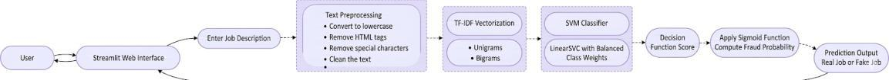

### Architecture Flow

1. User enters a job description.
2. Text preprocessing is applied.
3. TF-IDF converts text into numerical features.
4. SVM classifier analyzes the features.
5. Fraud probability is calculated.
6. Real/Fake prediction is displayed.

---

# 🧠 Machine Learning Pipeline

## 1. Data Collection

Dataset Source:

- Kaggle Fake Job Postings Dataset

Original Dataset Size:

- 17,880 Job Postings

---

## 2. Data Preprocessing

The following preprocessing operations are performed:

- Convert text to lowercase
- Remove HTML tags
- Remove special characters
- Remove punctuation
- Remove extra whitespace

---

## 3. Feature Engineering

TF-IDF Vectorization is used to transform job descriptions into numerical vectors.

Configuration:

- Unigrams + Bigrams
- Maximum Features: 8000
- English Stop Word Removal

---

## 4. Data Augmentation

To improve detection of modern scam patterns, synthetic fraudulent samples were added for:

- Crypto scams
- Wallet activation scams
- Security deposit scams
- Verification fee scams

Final Dataset Size:

- 17,939 Records

---

## 5. Model Training

Algorithm:

**Support Vector Machine (LinearSVC)**

Enhancements:

- Balanced Class Weights
- Stratified Train-Test Split
- Bigram Feature Extraction

---

## 6. Probability Estimation

LinearSVC does not provide probabilities directly.

The model's decision score is converted into a probability using a Sigmoid Function.

This enables:

- Fraud Probability Score
- Confidence Percentage
- Better User Interpretation

---

# 📊 Model Performance

## Final SVM Results

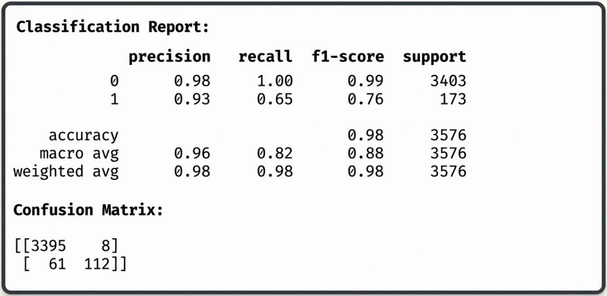

### Performance Metrics

| Metric | Score |
|----------|----------|
| Accuracy | 97.7% |
| Precision (Fake Jobs) | 76% |
| Recall (Fake Jobs) | 83% |
| F1 Score (Fake Jobs) | 79% |

The model was optimized to prioritize the detection of fraudulent job postings while maintaining high overall accuracy.

---

## Random Forest Comparison

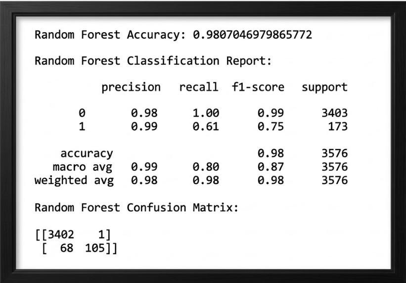

A Random Forest model was also tested during experimentation.

The SVM model was selected because it provided better fraud detection performance and recall.

---

# 📈 Dataset Analysis

## Dataset Distribution

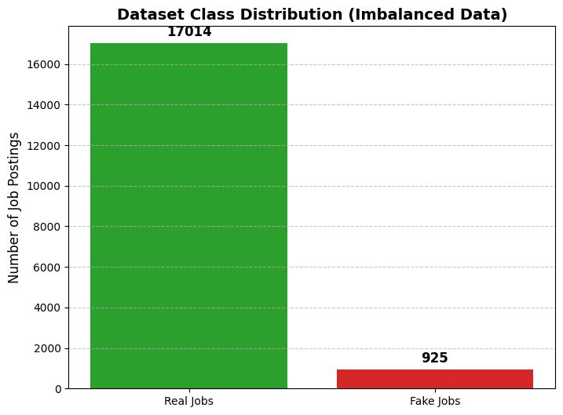

The dataset is highly imbalanced:

- Real Jobs: 17,014
- Fake Jobs: 925

Balanced Class Weights were applied to address this issue.

---

# 🌐 Application Screenshots

## Home Page


Users can enter any job description for analysis.

---

## Fake Job Detection Example

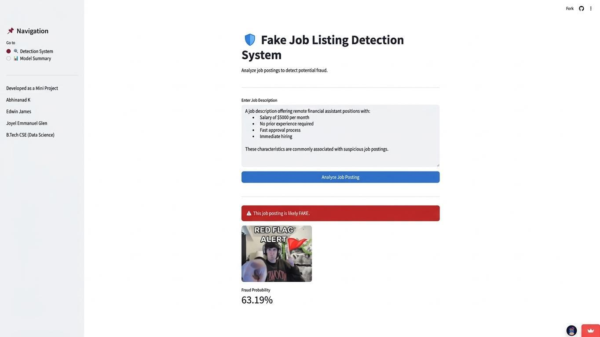

Example of a fraudulent job posting detected by the system.

Features shown:

- Fraud Alert
- Fraud Probability
- Visual Indicator

---

## Real Job Detection Example


Example of a legitimate job posting.

Features shown:

- Real Job Confidence Score
- Positive Validation Indicator

---

## Model Summary Page

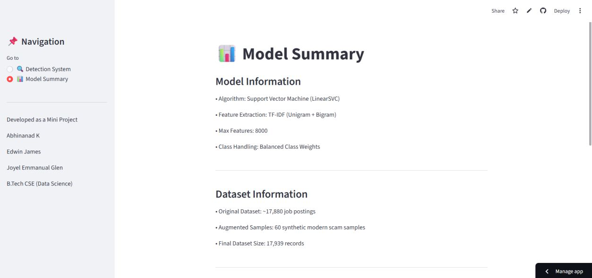

Displays:

- Model Information
- Dataset Information
- Performance Details

---

# 📋 System Design Diagrams

## Use Case Diagram

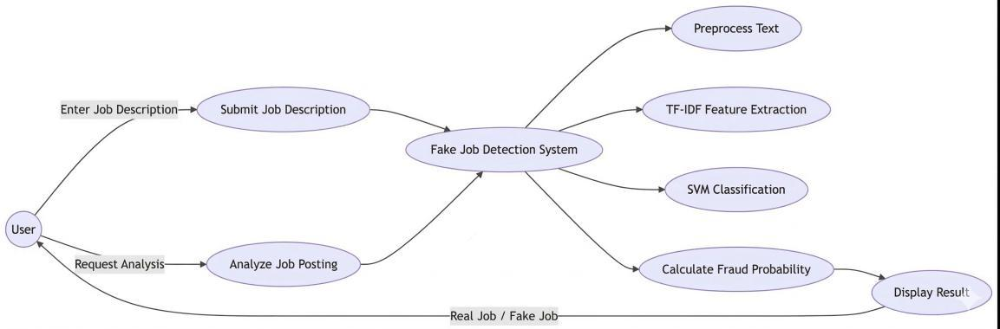

Illustrates interactions between users, administrators, and the system.

---

## Activity Diagram

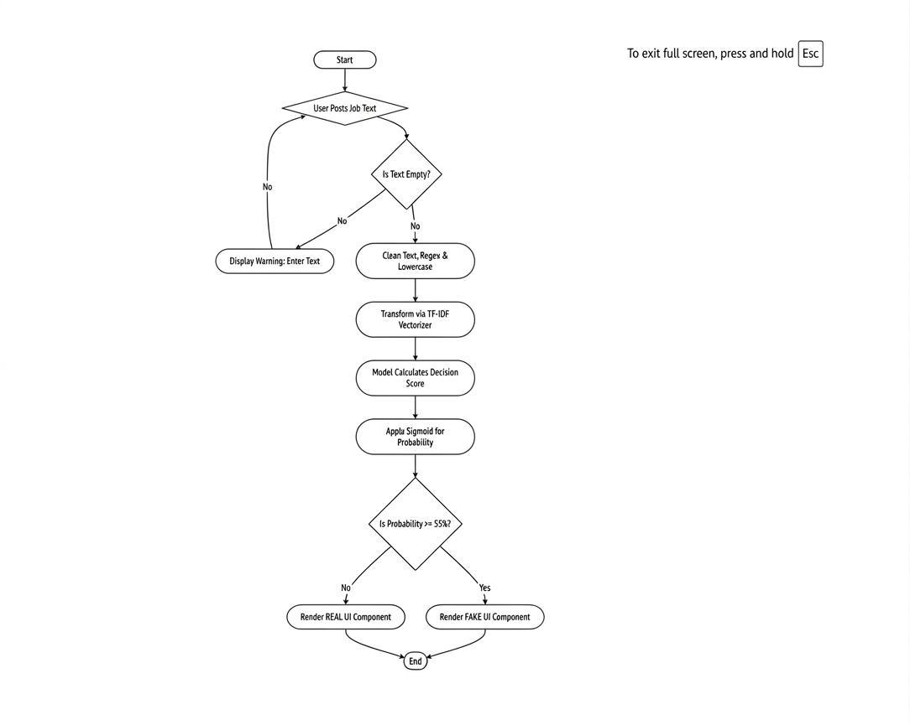

Shows the complete workflow from user input to prediction output.

---

## Data Flow Diagram

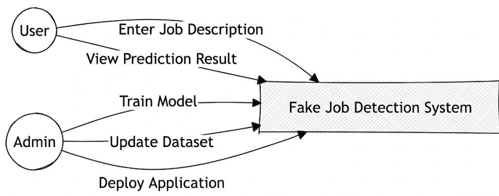

Represents the movement of information between the user, application, and machine learning model.

---

## Context Level DFD

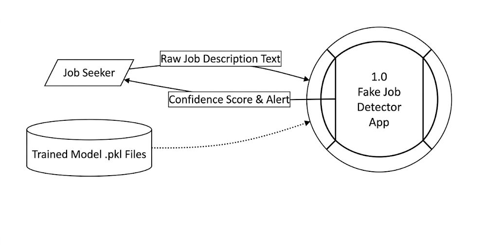

Provides a high-level overview of system interactions.

---

## Workflow Diagram

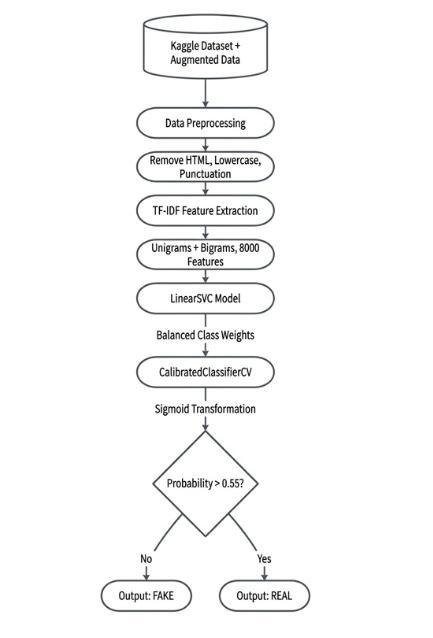

Illustrates the machine learning pipeline from preprocessing to prediction.

---

# 🚀 Installation

## Clone Repository

```bash
git clone https://github.com/E-TAT/fake-job-detection.git

cd fake-job-detection
```

---

## Create Virtual Environment (Optional)

### Windows

```bash
python -m venv venv

venv\Scripts\activate
```

### Linux / macOS

```bash
python3 -m venv venv

source venv/bin/activate
```

---

## Install Dependencies

```bash
pip install -r requirements.txt
```

---

# ▶️ Running the Project

Start the Streamlit application:

```bash
python -m streamlit run app.py
```

or

```bash
streamlit run app.py
```

The application will automatically open in your browser:

```text
http://localhost:8501
```

---

# 📁 Project Structure

```text
fake-job-detection/
│
├── screenshots/
│   ├── home_page.jpg
│   ├── fake_job_detection.jpg
│   ├── real_job_detection.jpg
│   ├── model_summary_page.jpg
│   ├── dataset_distribution.jpg
│   ├── svm_results.jpg
│   ├── random_forest_results.jpg
│   ├── use_case_diagram.jpg
│   ├── activity_diagram.jpg
│   ├── data_flow_diagram.jpg
│   ├── context_level_dfd.jpg
│   ├── system_architecture.jpg
│   └── workflow_diagram.jpg
│
├── app.py
├── requirements.txt
├── svm_model.pkl
├── tfidf_vectorizer.pkl
└── README.md
```

---

# 🔮 Future Enhancements

- Deep Learning Models (BERT)
- Explainable AI Predictions
- Browser Extension Integration
- Real-Time Job Portal Monitoring
- Multi-Language Support
- Cloud Deployment with Analytics Dashboard

---

